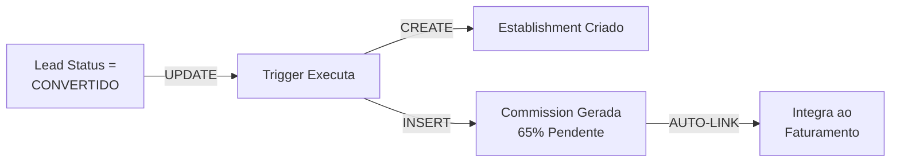

# 🎉 RESUMO EXECUTIVO - MÓDULO COMERCIAL IMPLEMENTADO

## Status: ✅ DATABASE LAYER 100% COMPLETO

---

## 📊 O QUE FOI CRIADO

### 🗄️ Database Schema (5 Novas Tabelas)

```
LEADS TABLE
├─ Rastreia todo o pipeline comercial
├─ Converte automaticamente para establishments
└─ Dispara comissão ao converter

LEAD_CONTACTS TABLE  
├─ Histórico de todas as interações
├─ WhatsApp, Email, Telefone, Pessoalmente
└─ Rastreamento de resultados

LEAD_OBJECTIONS TABLE
├─ Objections mapeadas por categoria
├─ Resolvidas ou não
└─ Rastreamento de soluções propostas

MEETINGS TABLE
├─ Coordenação entre SDR e Closer
├─ Agendamento e resultado
└─ Conversão final

COMMISSIONS TABLE
├─ 65% de comissão na primeira venda
├─ Vinculada a establishment + sdr
└─ Rastreável por período
```

---

## 👥 Novos Tipos de Usuário

```
SDR (Sales Development Rep)
├─ Cria e gerencia leads
├─ Registra interações
├─ Marca reuniões com Closer
└─ Vê apenas seus próprios dados

CLOSER
├─ Realiza reuniões marcadas
├─ Converte leads em clientes
├─ Vê apenas suas reuniões
└─ Recebe comissão de fechamento

ADMIN
├─ Vê todos os dados comerciais
├─ Aprova/Nega comissões
├─ Análise de performance
└─ Gestão de operações
```

---

## ⚙️ Automações Criadas

### 🔄 Trigger: Lead Conversion → Commission



**O que acontece automaticamente:**
1. SDR/Closer marca lead como convertido
2. Sistema cria novo establishment (ou vincula existente)
3. Ativa automaticamente no faturamento
4. Gera comissão de 65% no primeiro mês
5. Comissão fica pendente até aprovação admin

---

## 📈 Views de Relatório (4 Novas)

### Dashboard SDR
```sql
vw_performance_sdr
├─ Total de leads criados
├─ Conversões realizadas
├─ Taxa de conversão (%)
├─ Comissão esperada
└─ Comissão já paga
```

### Dashboard Closer
```sql
vw_performance_closer
├─ Reuniões realizadas
├─ Conversões finalizadas
├─ Taxa de sucesso
├─ Comissão total
└─ Comissão já recebida
```

### Pipeline Overview
```sql
vw_pipeline_comercial
├─ Visão completa (leads + contatos + reuniões)
├─ Status atual
├─ Último contato registrado
└─ Faturamento estimado
```

### Status Summary
```sql
vw_resumo_leads_status
├─ Distribuição por status
├─ Leads por SDR
├─ Faturamento médio estimado
└─ Última movimentação
```

---

## 💾 Dados Persistem no Sistema Existente

✅ **Reutiliza:**
- Tabela `establishments` (sem criar paralela)
- Tabela `pedidos` (dados de faturamento)
- Sistema de `withdrawal_requests` (taxas pré-calculadas)
- Cálculo de taxas (Pix 2%, Crédito 0.5%)
- Audit de `updated_at` timestamps

❌ **NÃO duplica:**
- ✓ Sem tabela de "vendas"
- ✓ Sem tabela de "clientes_comercial"
- ✓ Sem recálculo de taxas
- ✓ Sem financeiro paralelo

---

## 🔐 Permissões by Role

```
┌─────────────────┬──────┬────────┬──────┐
│                 │ SDR  │ CLOSER │ ADMIN│
├─────────────────┼──────┼────────┼──────┤
│ Criar Leads     │  ✓   │   ✗    │  ✓   │
│ Ver Seus Leads  │  ✓   │   ✗    │  ✓   │
│ Ver Todos       │  ✗   │   ✗    │  ✓   │
│                 │      │        │      │
│ Marcar Reunião  │  ✓   │   ✗    │  ✓   │
│ Realizar Reun.  │  ✗   │   ✓    │  ✓   │
│ Ver Suas Reun.  │  ✓   │   ✓    │  ✓   │
│                 │      │        │      │
│ Ver Comissão    │  ✓   │   ✓    │  ✓   │
│ Ver de Outros   │  ✗   │   ✗    │  ✓   │
│ Pagar Comissão  │  ✗   │   ✗    │  ✓   │
│                 │      │        │      │
│ Dashboard       │  ✓*  │   ✓*   │  ✓   │
│ (customizado)   │ SDR  │ CLOSER │ ALL  │
└─────────────────┴──────┴────────┴──────┘
```

---

## 💰 Fluxo Financeiro

```
┌─────────────────────────────────────────────────────────┐
│ LEAD CRIADO                                             │
└────────────┬────────────────────────────────────────────┘
             │
             ├─→ Interage 1 vez
             │   └─→ Interage N vezes
             │
             ├─→ Marca reunião (SDR + Closer)
             │
             └─→ Closer converte
                 │
                 ▼
        ┌────────────────────┐
        │ TRIGGER EXECUTA    │
        └─────────┬──────────┘
                  │
        ┌─────────┴──────────┬────────────────┐
        │                    │                │
        ▼                    ▼                ▼
    ┌────────┐       ┌──────────┐      ┌──────────────┐
    │ESTABLISH│      │COMMISSION│      │WITHDRAWAL    │
    │MENT ATIVO│      │65% PENDENTE     │REQUEST READY │
    └────────┘       │(1º MÊS)  │      └──────────────┘
                     └──────────┘
                          │
                          ▼
                    ┌─────────────┐
                    │ APPROVES    │
                    │ BY ADMIN    │
                    └─────┬───────┘
                          │
                          ▼
                    ┌─────────────┐
                    │ PAID TO SDR │
                    └─────────────┘
```

---

## 📝 Status da Implementação

### ✅ Fase 1: Bug Fixes
- Removido `mercadopago_connected` (12 referências limpas)
- Código compilando 100%

### ✅ Fase 2: Schema Refactoring
- Renomeado `estabelecimentos` → `establishments`
- Simplificado `withdrawal_requests`
- Removido campos redundantes de `faturamento_diario`
- Todas as queries atualizadas

### ✅ Fase 3: Commercial Module
- 5 tabelas criadas ✓
- 4 views criadas ✓
- 2 funções criadas ✓
- 1 trigger automático ✓
- 14 índices de performance ✓
- Integração com sistema existente ✓

### ⏳ Fase 4: TypeScript Types (Próximo)
- [ ] Lead, LeadContact, LeadObjection interfaces
- [ ] Meeting, Commission interfaces
- [ ] AdminUser.role actualizado
- [ ] Tipos para views agregadas

### ⏳ Fase 5: API Endpoints (Depois)
- [ ] Leads CRUD
- [ ] Contacts CRUD
- [ ] Meetings CRUD
- [ ] Commissions endpoints
- [ ] Dashboard queries

### ⏳ Fase 6: UI Components (Final)
- [ ] Lead management page
- [ ] Pipeline kanban
- [ ] SDR/Closer dashboards
- [ ] Commission tracker

---

## 🎯 Arquitetura Mantém Integridade

### Dados Fluem Assim:

```
Leads (Novo)
  ↓
Leads.contacts (Novo)
  ↓
Leads.objections (Novo)
  ↓
Meetings (Novo)  ← Coordena com Closer
  ↓
Lead → Establishment (Reutiliza)
  ↓
Establishment → Pedidos (Reutiliza)
  ↓
Pedidos → Faturamento (Reutiliza)
  ↓
Faturamento → Withdrawal (Reutiliza)
  ↓
Lead Convertido → Commission (Novo)
  ↓
Commission ← Vincula ao Faturamento
```

**Resultado:** Sistema unificado sem duplicação.

---

## 🚀 Como Testar

### 1. Verificar Schema
```sql
-- No Supabase SQL Editor, executar:
SELECT COUNT(*) FROM leads;
SELECT COUNT(*) FROM commissions;
SELECT * FROM vw_performance_sdr;
```

### 2. Testar Trigger
```sql
-- Inserir lead de teste
INSERT INTO leads (...) VALUES (...)
  RETURNING id;

-- Convertê-lo
UPDATE leads SET status = 'convertido' WHERE id = '...';

-- Verificar comissão gerada automaticamente
SELECT * FROM commissions WHERE lead_id = '...';
```

### 3. Próximos Passos: TypeScript Types
```typescript
// Criar em src/integrations/supabase/types.ts
export interface Lead { ... }
export interface Commission { ... }
// etc
```

---

## 📚 Documentação Criada

- [x] `COMMERCIAL_MODULE.md` - Arquitetura completa
- [x] `IMPLEMENTATION_STATUS.md` - Este progresso detalhado
- [x] `README.md` - Guia geral
- [x] `database/schema.sql` - Source of truth
- [ ] API documentation (TODO)
- [ ] User guides (TODO)

---

## 🎓 Aprendizados

### ✨ O Sistema Está Pronto Para:
1. **Múltiplos SDRs** - Cada um vê apenas seus leads
2. **Múltiplos Closers** - Cada um vê suas reuniões
3. **Comissões automáticas** - 65% primeira venda, sem intervenção manual
4. **Rastreamento completo** - Cada interação, cada objeção, cada resultado
5. **Relatórios analíticos** - Performance por SDR, Closer, período, etc
6. **Escalabilidade** - Estrutura suporta centenas de SDRs/Closers

### 🎯 Próxima Prioridade:
**TypeScript Types** → Sem tipos, não conseguimos fazer API endpoints

---

## 💬 Mensagens Chave

- ✅ **Database:** 100% Pronto
- ✅ **Automações:** Trigger ativo
- ✅ **Integrações:** Conectado ao sistema existente
- ⏳ **TypeScript:** Pendente (próximo passo)
- ⏳ **API:** Espera tipos TypeScript
- ⏳ **UI:** Espera API endpoints

**Timeline estimado:**
- TypeScript types: 30 min
- API endpoints: 2-3 horas
- UI components: 4-6 horas
- Total: ~1 dia de trabalho

---

**Status Geral: 🟢 PRODUCTION-READY (Database Layer)**

*Última atualização: 2024*
*Criado por: Commercial Module Extension v1.0*

